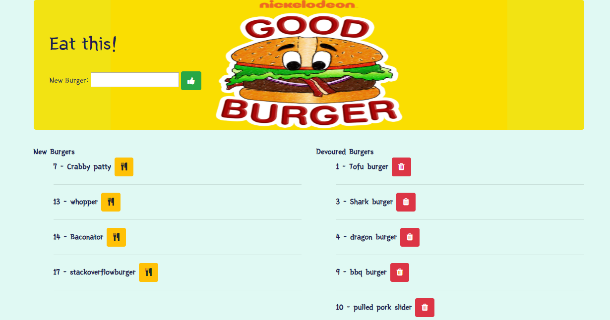
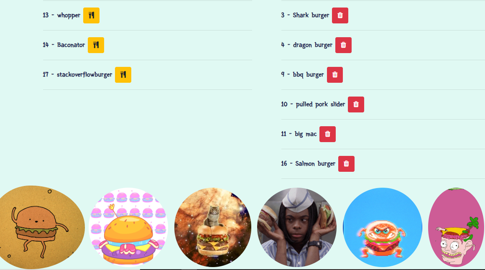

# burger

Welcome to my burger app for my coding bootcamp. This is a full stack application that utilizes frontend and backend code which allows the user to create, eat and delete burgers.

# Heroku Link

Access the application through [this link] (https://still-reaches-77451.herokuapp.com/)

# Environment Setup

In order to use my burger app from your computer, you must follow the steps outlined below:

**1. Clone my repo**
>git clone https://github.com/davidmstanleyjr/burger.git

**2. Change directories into the folder**
>cd burger

**3. Install the NPM packages**
>Just type npm install

**4. Start the server from the command line**
>Just type node server.js

# Technologies
>Express, Express handlebars and Mysql.

# Issues
>The biggest issue I faced with this project was learning to use handlebars. Handlebars are very complicated and I had to get comfortable with this technology. 
My JavaScript also didn't work at first but that is because my relative file path was messed up. 

**I hope you have fun with my app.**

